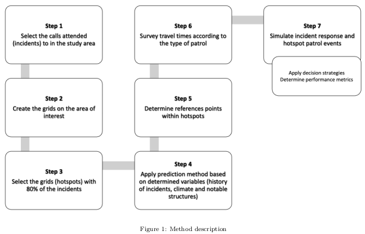
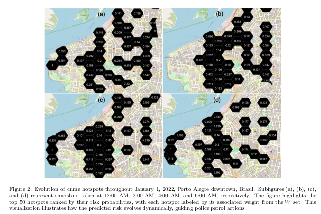
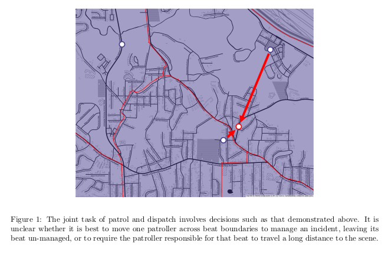
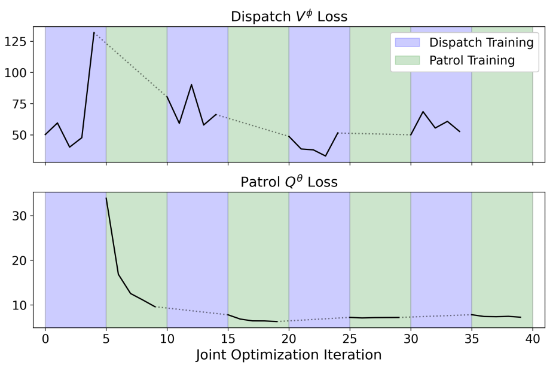
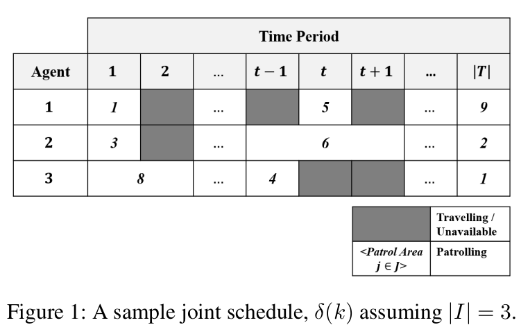
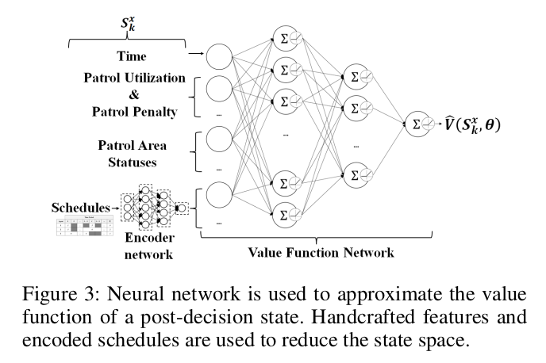
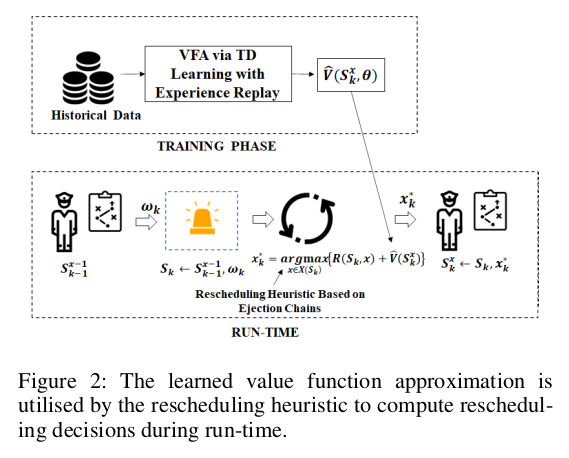

# RL Multi-Objetivo Aplicado ao Problema Integrado de Patrulha e Despacho

Moacir Almeida Simões Júnior
Tobias de Abreu Kuse

---

### O Problema Central: Um Conflito de Objetivos

- Operações policiais têm dois objetivos conflitantes e simultâneos.  
- **1. Patrulhamento Proativo:** Maximizar a *presença* em áreas de alto risco ("hotspots") para dissuadir o crime.  
- **2. Despacho Reativo:** Minimizar o *tempo de resposta* a novas chamadas de emergência dinâmicas.  
- **O Desafio:** Cada vez que uma unidade é despachada *reativamente*, ela compromete o plano de patrulha *proativo*.  
- Este é um problema **bi-objetivo**.

---

### Um Panorama das Soluções

- Problema complexo: mistura previsão espaço-temporal, roteamento e eventos estocásticos em tempo real.  
- Três filosofias de solução principais:  
  1. Modelos **Híbridos Heurísticos** (Simulação + Meta-heurísticas)  
  2. Modelos **MARL Descentralizados** (RL Multiagente)  
  3. Modelos **MORL Centralizados** (RL Multi-Objetivo)

---

### Abordagem 1: Híbrida-Heurística  
*(Simões Júnior & Borenstein, 2025)*

- **Conceito:** Modelar o sistema com simulação de eventos discretos.  
- **Método:**  
  - **Prever:** Usar ML (ex: XGBoost) para prever *hotspots dinâmicos*.  
  - **Patrulhar:** Usar **Otimização por Colônia de Formigas (ACO)** para rotas de patrulha ideais.  
  - **Testar:** Simular interrupções por chamadas aleatórias.  
- **Conclusão:** Abordagem de *"otimizar e depois simular"*.

---

### Abordagem 1: Método e Hotspots Dinâmicos

---

<!-- ### Abordagem 1: Fluxograma do Método

--- -->

### Abordagem 2: Modelo Multiagente  
*(Repasky et al., 2024)*

- **Conceito:** Cada viatura = um agente de RL.  
- **Método:**  
  - Sistema **heterogêneo** com $N+1$ agentes.  
  - **$N$ Patrulheiros:** aprendem políticas próprias (DQN compartilhada).  
  - **1 Despachante:** aprende política central (MIP + VFA).  
- **Conclusão:** Abordagem **descentralizada**, com agentes aprendendo individualmente.

---

### Abordagem 2: Visualização do Modelo MARL

---

### Abordagem 3: RL Multi-Objetivo (MORL)

- RL padrão → recompensa escalar $R$.  
- MORL → vetor de recompensas $\vec{R} = \langle R_{\text{resposta}}, R_{\text{presença}} \rangle$.  
- **Desafio:** "Ótimo" é subjetivo (quanto vale piorar patrulha pra melhorar resposta?).  
- **Solução comum:** Soma ponderada  
  $$R_{total} = w_1 R_{resposta} + w_2 R_{presença}$$  
- **Problema:** Altamente sensível aos pesos — arbitrários e difíceis de justificar.

---

### MORL: Abordagens Conceituais

- **1. Método de Restrições (Constraint-based):**
  - Otimiza um objetivo principal e trata os outros como **restrições**.
  - **Exemplo:** "Maximizar a *Resposta* (Objetivo 1), contanto que (Restrição) a *Presença da Patrulha* (Objetivo 2) não caia abaixo de 80%."
  - **Vantagem:** Mais intuitivo para um gestor definir um desempenho mínimo do que pesos arbitrários.

- **2. Abordagens Vetoriais (Policy/Value-based):**
  - O agente não aprende um Q-Valor escalar, mas sim um **Q-Vetor**: $\vec{Q}(s, a) = \langle Q_{resposta}, Q_{presença} \rangle$
  - O objetivo não é encontrar "um" ótimo, mas sim o conjunto de todas as **Soluções de Trade-off** (não é possível melhorar um objetivo sem piorar o outro).
---

### Estudo de Caso: MORL Aplicado ao Problema Integrado de Patrulhamento e Despacho

- Para contornar as dificuldades da "soma ponderada", o artigo de **Joe, Lau, & Pan (2022)** propõe uma **função de recompensa** que não exige atribuir pesos aos objetivos.
- **Título:** *Reinforcement Learning Approach to Solve Dynamic Bi-objective Police Patrol Dispatching and Rescheduling Problem*  
- **Formulação:** MDP Centralizado de Agente Único.  
- **Agente de RL:** Planejador central / despachante.  
- **Recursos:** Unidades de patrulha (recursos controlados).  
- Não é MARL — unidades não aprendem.

---

### O MDP: Estado e Ação

- **Estado ($S_k$):** É a tupla: $\langle t_k, \delta(k), \sigma(k), \omega_k \rangle$
  - $t_k$: Hora atual
  - $\delta(k)$: Cronogramas conjuntos atuais
  - $\sigma(k)$: Status da patrulha
  - $\omega_k$: O novo incidente (local, tempo, duração)

- **Ação ($x_k$):** tupla de decisão $\langle x_k^i, x_k^t, \delta^x(k) \rangle$.
  - $x_k^i$: quem despachar
  - $x_k^t$: quando
  - $\delta^x(k)$: novo cronograma unificado

---

### O MDP: Exemplo de Cronograma Conjunto ($\delta(k)$)

---

### MDP: Transição e Recompensa

- **Transição ($S_k \rightarrow S_k^x$):**
  - A transição do estado é determinística.
  - A Ação $x_k$ (o novo cronograma $\delta^x(k)$) é aplicada.
  - O estado muda de "pré-decisão" ($S_k$) para "pós-decisão" ($S_k^x$).

- **Recompensa ($R$): multiplicativa e diferencial**
    $$R(S_k, x_k) = f_r(x_k) \times (f_p(\delta^x(k)) - f_p(\delta(k)))$$
  - **Componentes:**
    - $f_r(x_k) \rightarrow$ Sucesso da Resposta (1.0, 0.5, 0)
    - $f_p(\delta^x(k)) - f_p(\delta(k)) \rightarrow$ Mudança na Qualidade da Patrulha

---

### MDP: A Função Objetivo

- O objetivo do agente é encontrar a ação $x_k^*$ que resolve a Equação de Otimização:
  $$x_k^* = \text{argmax}_{x_k} \{ R(S_k, x_k) + \gamma\hat{V}(S_k^x) \}$$

- **A Premissa do Aprendizado (RL):**
  - Para resolver esta equação, o agente precisa de uma forma de *calcular* o segundo termo.
  - O **Valor Futuro ($\hat{V}(S_k^x)$)** é desconhecido.
  - O agente precisa *aprender* a estimar o "valor" de um estado pós-decisão a partir da experiência.

---

### Solução: O Avaliador de Ações (VFA)

- O $\hat{V}$ (o "Avaliador") é uma **Rede de Função Valor (VFN)** que estima o Valor Futuro $\hat{V}(S_k^x)$.

- É treinado **Offline** (antes da execução), usando **Aprendizado por Diferença Temporal (TD Learning)**.

- O treinamento utiliza **Dados Históricos** (o princípio do *Experience Replay*).

- **Propósito:** Produzir um "cérebro" treinado que sabe dar a "nota" (o $\hat{V}$) para qualquer novo cronograma.

---

### O Avaliador ($\hat{V}$): Diagrama da Rede

---

### Solução: O Gerador de Ações - Ejection Chains (EC)

- **Processo (Online):**
  - 1. A EC *insere* o incidente $\omega_k$ no cronograma de uma Viatura A (criando um "defeito").
  - 2. A EC *repara* o defeito (ex: "ejetando" uma tarefa de A para B), criando uma "reação em cadeia".

- **Conexão Chave (EC + V̂):**
  - A $\hat{V}$ é consultada *durante* a cadeia de reparo para guiar a heurística a escolher o melhor reparo ("greedy") a cada passo.

---

### Arquitetura: Treinamento (Offline) e Execução (Online)

---

### Pontos para Discussão e Considerações

- **1. Modelo "Agnóstico" à Gravidade:**
  - A função de recompensa ($R$) trata todos os incidentes da mesma forma (1.0, 0.5, 0 pelo *tempo* de resposta).
  - Ela não usa uma tabela de prioridade (ex: "Risco à Vida" vs. "Furto").

- **2. Risco da Otimização "Pura":**
  - O sistema pode (corretamente) decidir *postergar* um incidente grave, se ele tiver um "custo" muito alto para a patrulha (baixa recompensa futura esperada).

- **3. Sugestão de Melhoria:**
  - Incorporar um **fator de prioridade ($p$)** (baseado na gravidade) diretamente na função de recompensa, como um multiplicador.

---

### Resumo das Abordagens

- **Problema:** Patrulha Integrada (Proativa) & Despacho (Reativo).

- **Híbrida/Heurística (Simões Júnior & Borenstein, 2025):**
  - Poderosa, mas depende de heurísticas de PO (como ACO) para *construir* a política.

- **MARL Descentralizado (Repasky et al., 2024):**
  - "Bottom-up". Trata viaturas como agentes, mas *decompõe* o problema (Patrulha vs. Despacho).

- **MORL Centralizado (Joe, Lau, & Pan, 2022):**
  - Abordagem holística. Usa RL ($\hat{V}$) para *guiar* uma heurística (EC) e resolver o problema unificado.

---

# Obrigado! 🙌  
Perguntas?
