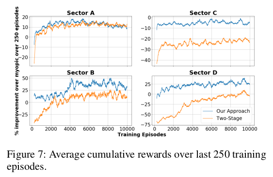
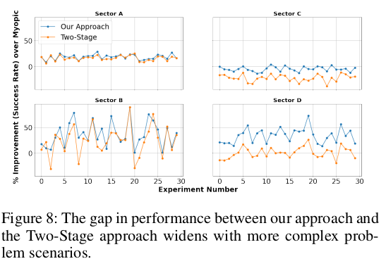

# RL Multi-Objetivo Aplicado ao Problema Integrado de Patrulha e Despacho

Moacir Almeida Simões Júnior
Tobias de Abreu Kuse

---

### O Problema Central: Um Conflito de Objetivos

- Operações policiais têm dois objetivos conflitantes e simultâneos.  
- **1. Patrulhamento Proativo:** Maximizar a *presença* em áreas de alto risco ("hotspots") para dissuadir o crime.  
- **2. Despacho Reativo:** Minimizar o *tempo de resposta* a novas chamadas de emergência dinâmicas.  
- **O Desafio:** Cada vez que uma unidade é despachada *reativamente*, ela compromete o plano de patrulha *proativo*.  
- Este é um problema **bi-objetivo**.

---

### Um Panorama das Soluções

- Problema complexo: mistura previsão espaço-temporal, roteamento e eventos estocásticos em tempo real.  
- Três filosofias de solução principais:  
  1. Modelos **Híbridos Heurísticos** (Simulação + Meta-heurísticas)  
  2. Modelos **MARL Descentralizados** (RL Multiagente)  
  3. Modelos **MORL Centralizados** (RL Multi-Objetivo)

---

### Abordagem 1: Híbrida-Heurística  
*(Simões Júnior & Borenstein, 2025)*

- **Conceito:** Modelar o sistema com simulação de eventos discretos.  
- **Método:**  
  - **Prever:** Usar ML (ex: XGBoost) para prever *hotspots dinâmicos*.  
  - **Patrulhar:** Usar **Otimização por Colônia de Formigas (ACO)** para rotas de patrulha ideais.  
  - **Testar:** Simular interrupções por chamadas aleatórias.  
- **Conclusão:** Abordagem de *"otimizar e depois simular"*.

---

### Abordagem 1: Método e Hotspots Dinâmicos

---

<!-- ### Abordagem 1: Fluxograma do Método

--- -->

### Abordagem 2: Modelo Multiagente  
*(Repasky et al., 2024)*

- **Conceito:** Cada viatura = um agente de RL.  
- **Método:**  
  - Sistema **heterogêneo** com $N+1$ agentes.  
  - **$N$ Patrulheiros:** aprendem políticas próprias (DQN compartilhada).  
  - **1 Despachante:** aprende política central (MIP + VFA).  
- **Conclusão:** Abordagem **descentralizada**, com agentes aprendendo individualmente.

---

### Abordagem 2: Visualização do Modelo MARL

---

### Abordagem 3: RL Multi-Objetivo (MORL)

- RL padrão → recompensa escalar $R$.  
- MORL → vetor de recompensas $\vec{R} = \langle R_{\text{resposta}}, R_{\text{presença}} \rangle$.  
- **Desafio:** "Ótimo" é subjetivo (quanto vale piorar patrulha pra melhorar resposta?).  
- **Solução comum:** Soma ponderada  
  $$R_{total} = w_1 R_{resposta} + w_2 R_{presença}$$  
- **Problema:** Altamente sensível aos pesos — arbitrários e difíceis de justificar.

---

### Visão Geral e Formulação

- Para contornar as dificuldades da abordagem de soma ponderada, o artigo de **Joe, Lau, & Pan (2022)** apresenta um modelo MORL centralizado que não utiliza essa técnica.
- **Título:** *Reinforcement Learning Approach to Solve Dynamic Bi-objective Police Patrol Dispatching and Rescheduling Problem*  
- **Formulação:** MDP Centralizado de Agente Único.  
- **Agente de RL:** Planejador central / despachante.  
- **Recursos:** Unidades de patrulha (recursos controlados).  
- Não é MARL — unidades não aprendem.

---

### O MDP: Estado e Ação

- **Estado ($S_k$):** É a tupla: $\langle t_k, \delta(k), \sigma(k), \omega_k \rangle$
  - $t_k$: Hora atual
  - $\delta(k)$: Cronogramas conjuntos atuais
  - $\sigma(k)$: Status da patrulha
  - $\omega_k$: O novo incidente (local, tempo, duração)

- **Ação ($x_k$):** tupla de decisão $\langle x_k^i, x_k^t, \delta^x(k) \rangle$.
  - $x_k^i$: quem despachar
  - $x_k^t$: quando
  - $\delta^x(k)$: novo cronograma unificado

---

### O MDP: Exemplo de Cronograma Conjunto ($\delta(k)$)

---

### MDP: Transição e Recompensa

- **Transição ($S_k \rightarrow S_k^x$):**
  - A transição do estado é determinística.
  - A Ação $x_k$ (o novo cronograma $\delta^x(k)$) é aplicada.
  - O estado muda de "pré-decisão" ($S_k$) para "pós-decisão" ($S_k^x$).

- **Recompensa ($R$): multiplicativa e diferencial**
    $$R(S_k, x_k) = f_r(x_k) \times (f_p(\delta^x(k)) - f_p(\delta(k)))$$
  - **Componentes:**
    - $f_r(x_k) \rightarrow$ Sucesso da Resposta (1.0, 0.5, 0)
    - $f_p(\delta^x(k)) - f_p(\delta(k)) \rightarrow$ Mudança na Qualidade da Patrulha
---

### MDP: A Função Objetivo

- O objetivo do agente é encontrar a ação $x_k^*$ que resolve a Equação de Otimização:
  $$x_k^* = \text{argmax}_{x_k} \{ R(S_k, x_k) + \gamma\hat{V}(S_k^x) \}$$

- **O Desafio Computacional:**
  - Como resolver este `argmax`?
  - O espaço de ações $x_k$ (os novos cronogramas) é de alta dimensionalidade (combinatorial).
  - A solução padrão (ex: DQN, que itera sobre todas as ações) não é aplicável.

---

### A Solução: Arquitetura Híbrida

- O artigo resolve o `argmax` intratável com uma **divisão de trabalho**:

- **1. Gerador de Ações (Online):**
  - Uma heurística clássica (Ejection Chains) gera um conjunto pequeno de ações $x_k$ (novos cronogramas) que são viáveis e de alta qualidade.

- **2. Avaliador de Ações (Offline):**
  - Uma Rede de Função Valor ($\hat{V}$) é treinada offline com Dados Históricos (Experience Replay).
  - O único trabalho desta rede é calcular o valor futuro $\hat{V}(S_k^x)$ (a "nota") para qualquer cronograma.

- **A Decisão (Eq. 6):**
  - O sistema aplica a heurística para gerar as opções $x_k$.
  - O $\hat{V}$ treinado avalia (dá a nota) para cada opção.
  - O agente simplesmente escolhe a opção com a maior nota (Recompensa Imediata + Valor Futuro).

---

### A Solução: Arquitetura do Modelo

---

### Inovação Bi-Objetivo (Sem Soma Ponderada)

- Recompensa **multiplicativa e diferencial**:
  $$R(S_k, x_k) = f_r(x_k) \times f_p(\delta^x(k)) - f_p(\delta(k))$$
- **Componentes:**
  - $f_r(x_k)$ → sucesso da resposta (1.0, 0.5, 0)  
  - $f_p(\delta^x(k)) - f_p(\delta(k))$ → mudança na presença da patrulha  
- **Justificativa da Abordagem:**  
  - A recompensa pondera *resposta* × *impacto na patrulha*.  
  - Uma falha que destrói o plano de patrulha → fortemente penalizada.

---

### Resultados Chave

- **Desempenho do Aprendizado:**
  - O modelo "integrado" (Joint) aprende mais rápido e atinge uma recompensa cumulativa maior e mais estável.
  - O método "Two-Stage" se mostra instável e inferior, especialmente em cenários complexos.

- **Taxa de Sucesso Final:**
  - O híbrido ($\hat{V}$ + heurística) supera estatisticamente o método "Two-Stage" na taxa de sucesso de resposta.

<!-- ---

### Resultados: Análise Gráfica

 -->

<!-- ---

### Resumo das Abordagens

- **Problema:** Patrulha Integrada (Proativa) & Despacho (Reativo).  
- **Híbrida/Heurística:** poderosa, mas depende de heurísticas (ACO).  
- **MARL:** baseado em agentes, mas decompõe o problema.  
- **MORL Centralizado:** abordagem holística (VFA + heurística inteligente).

---

### Principais Conclusões

- Problema real e ideal para RL avançado.  
- Arquitetura de Joe, Lau & Pan:  
  - **Gerador-Heurístico + Avaliador-VFA** → ótimo para espaços de ação complexos.  
- Recompensa multiplicativa → resolve bi-objetivo sem pesos arbitrários. -->

---

# Obrigado! 🙌  
Perguntas?
